# Ford hackathon

# About

Car Appstore from scratch for the Ford hackathon using Flask.

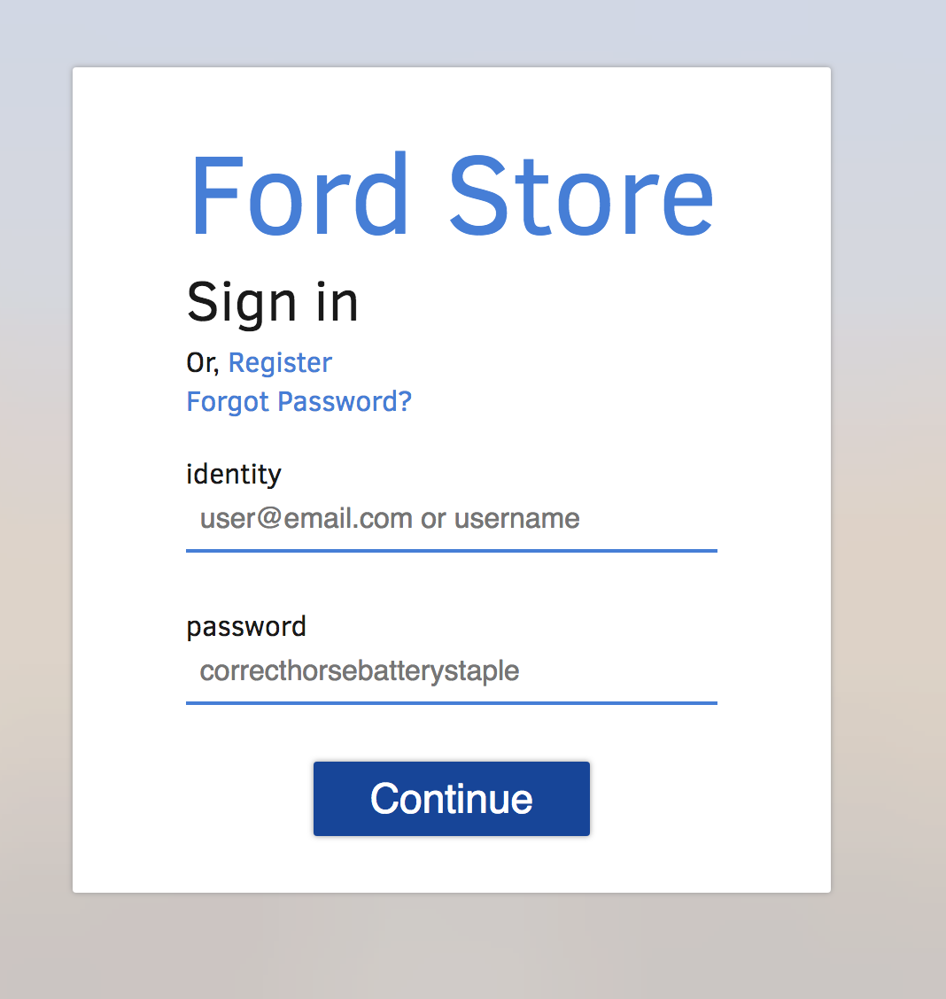
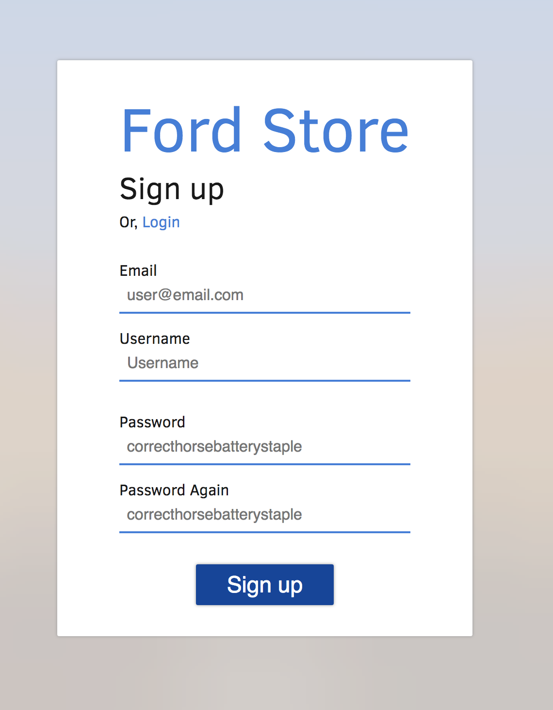
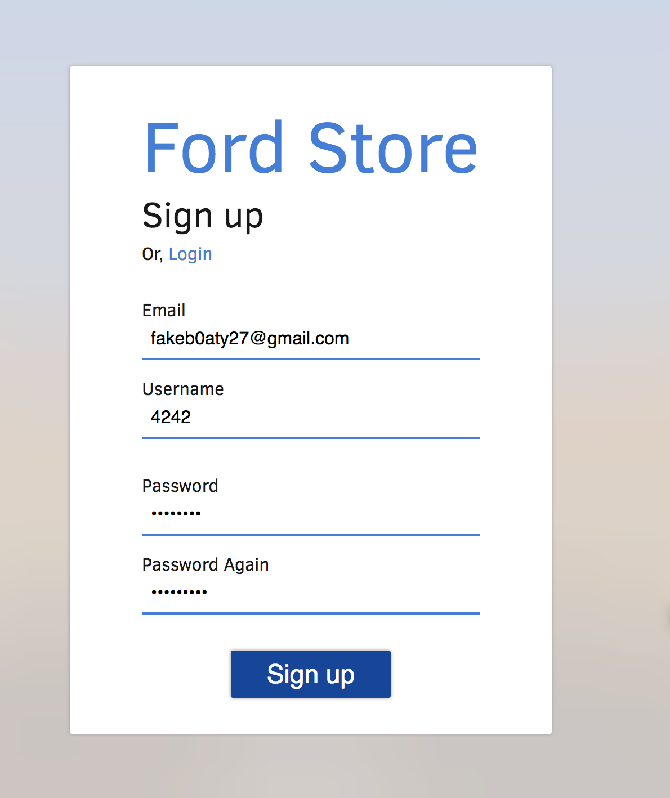
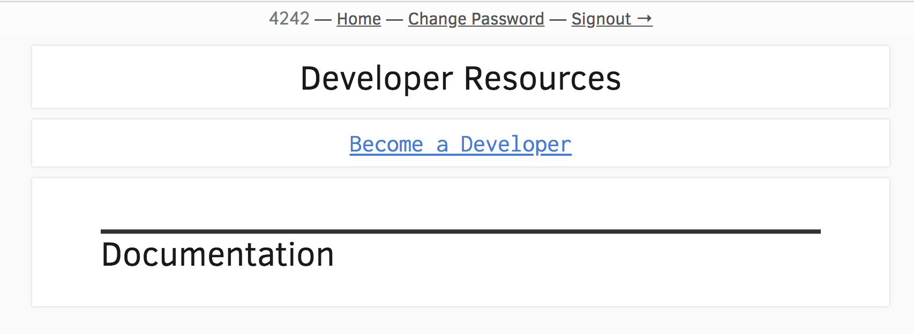
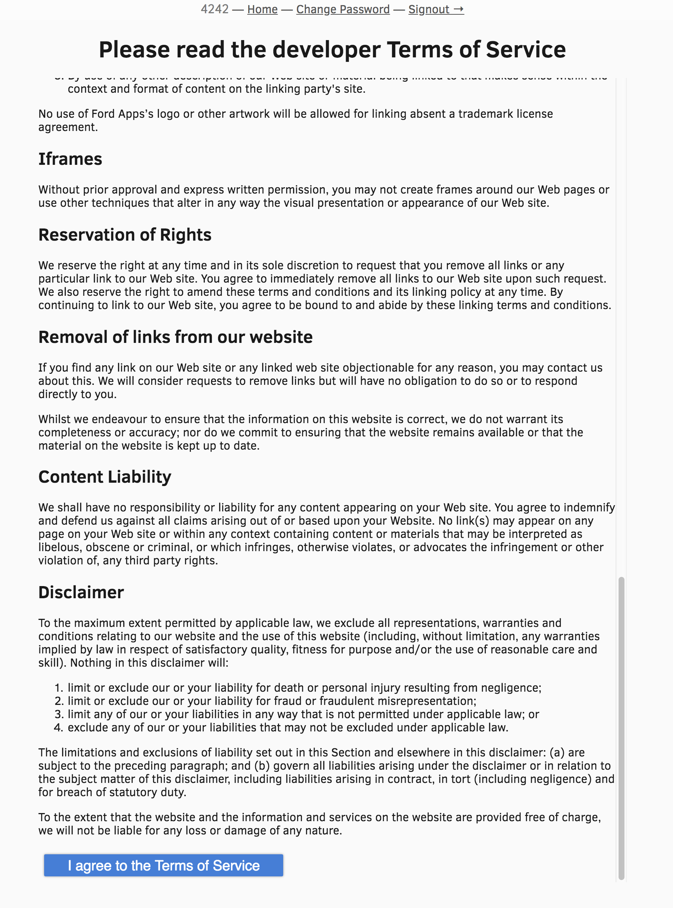
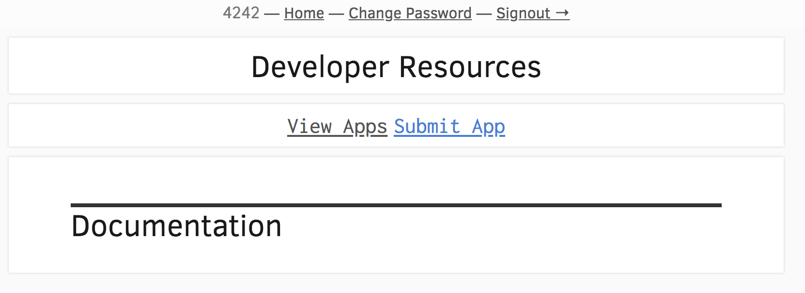
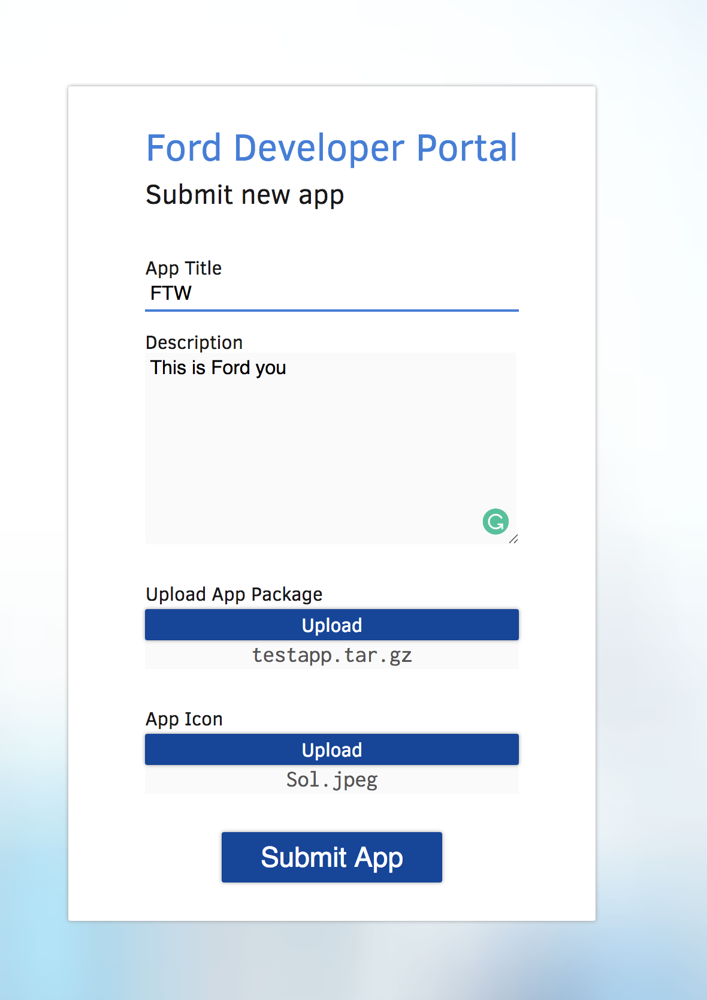
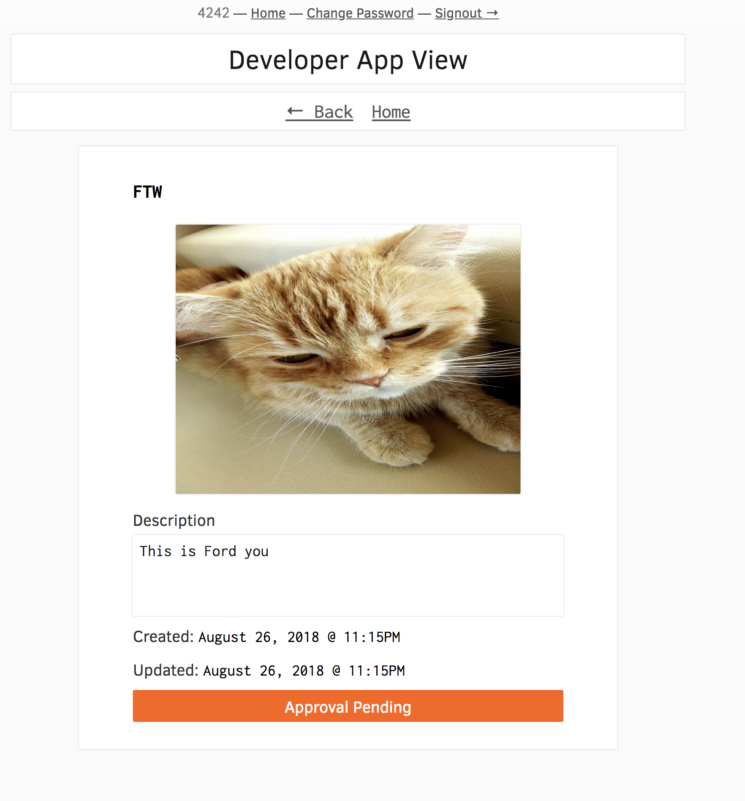
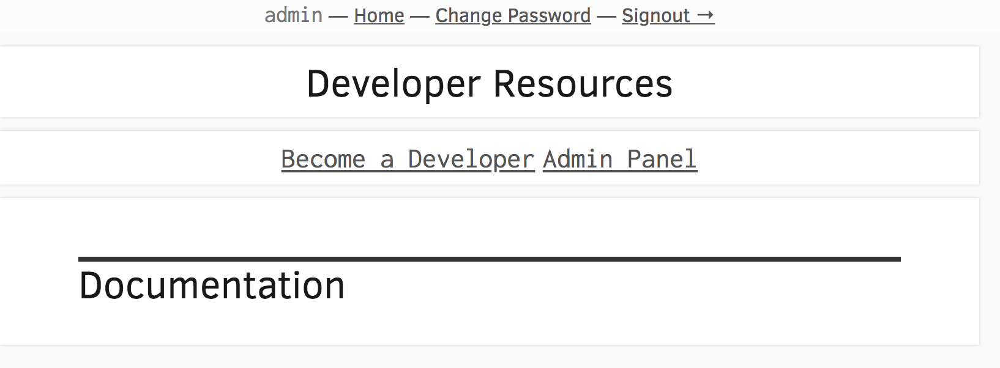
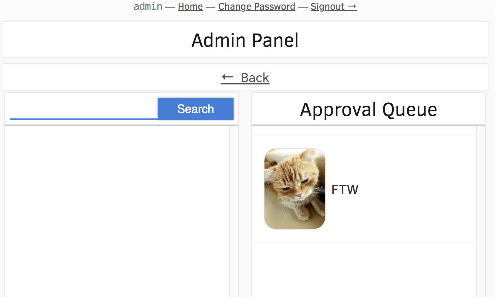
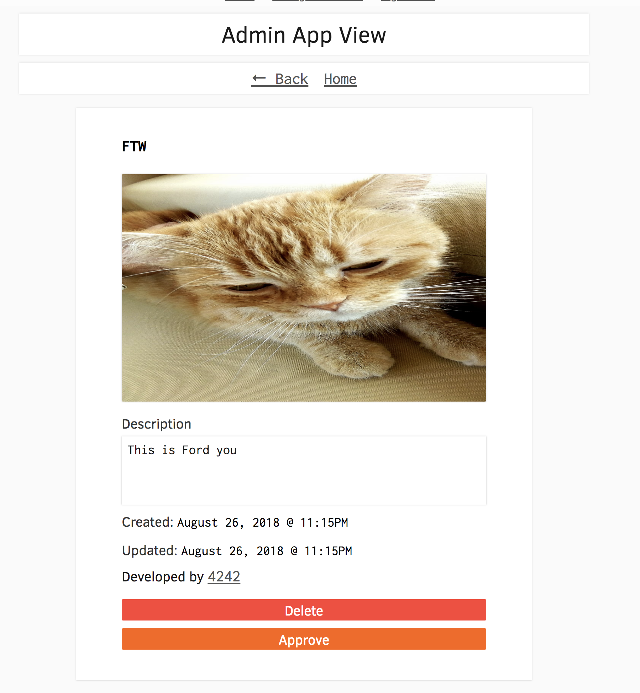
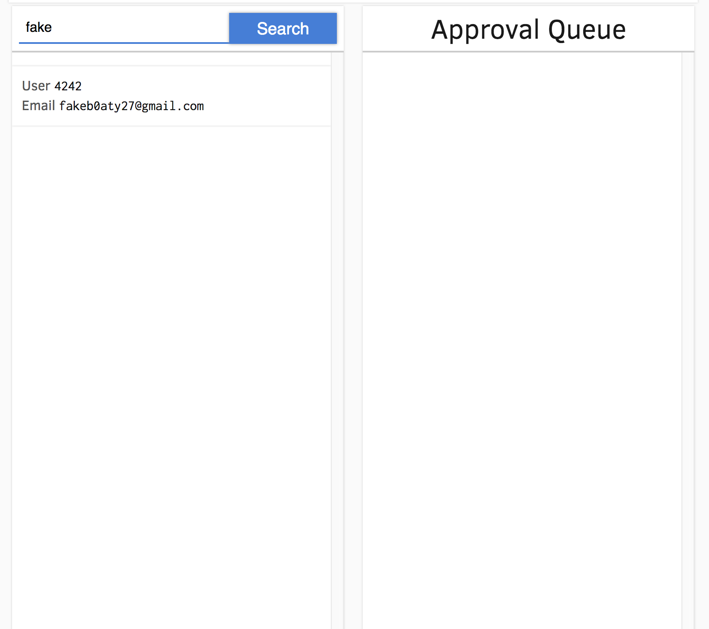
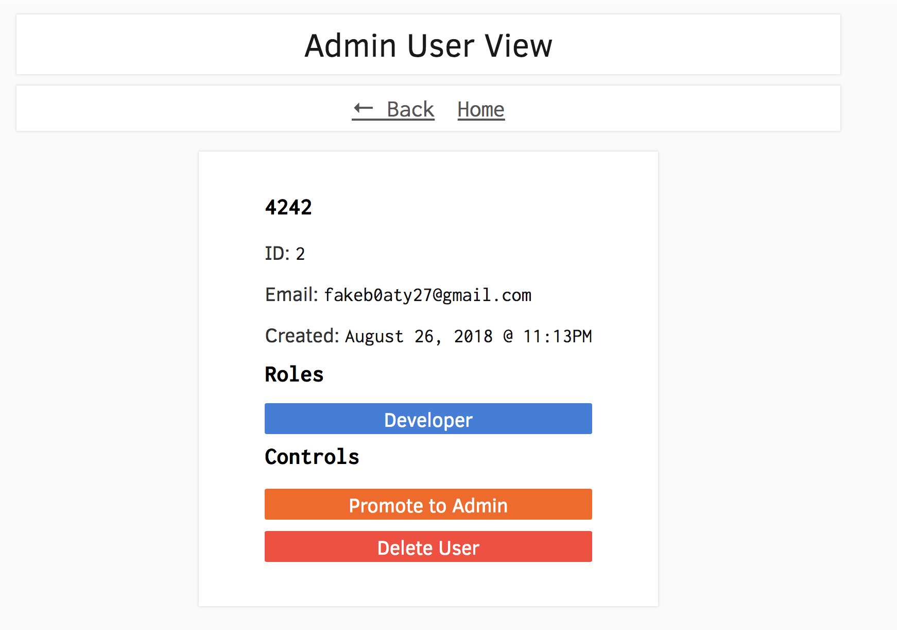

### Features
* User creation
* User roles
* Application submission and approval
* Application checksum verification
* Multiple Application Types
* Password recovery
* SPA Client

## Client

### Running
`cd client` and start with `./run.sh`  
view at `localhost:5000`

## Server

### Running

`cd server` and start with `./run.sh`  
view at `localhost:5000/login`

## Docs

### Generating
`cd sphinx` and `./docs.sh`

### Team

[Logan Kaser](https://github.com/logankaser)

[Zeid Tisnes](https://github.com/zedin27)

[Theo Walton](https://github.com/theo-walton)
