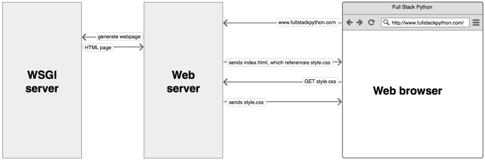

# Ford Hackathon notes

## Some frameworks

### Flask SQLalchemy

### General notes

To start with, learning a different language helps to grow a different architecture of how to work in the project depending in of the language. For this, I'm relearning Python by using Flask. So far so good, just a little bit rusty in my thought process and how to work on front-end. Few words that I found out that I'm not familiar are:

1. **WSGI** (Web Server Gateway Interface): standard interface that modules and containers could implement. It helps to swap out web stack components for others, which is flexible. Also, servers promote scaling properties to thousands of requests for dynamic content at once. It handles processing requests from the web server and how it communicate between those requests to an application framework's process.

### Sphinx

Sphinx is a tool to beautify documentation built in using `pip3 install sphinx`.
